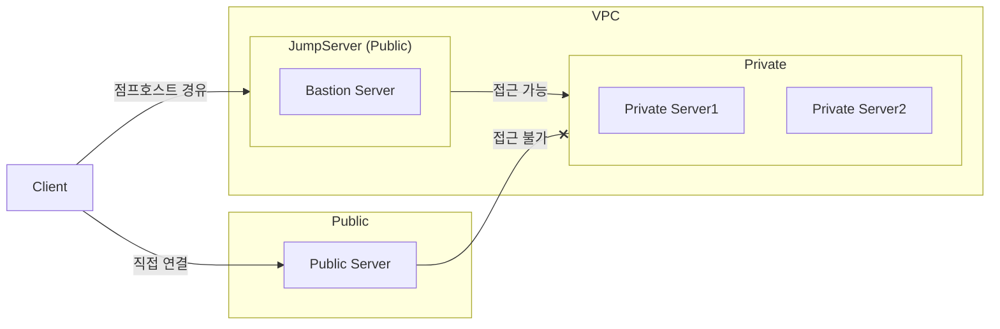

# Bastion Server (베스천서버)

베스천서버는 흔히 점프서버라 말하며, 점프 호스트, 점프 박스 등으로 이야기하곤 한다.

점프서버는 두 개 이상 네트워크 사이에 중간 지역으로 존재하며 보안을 위해 거쳐야하는 보안 게이트의 개념이다.

점프서버는 보통 외부에서 함부로 접근하지 못하도록 접근을 제한하고 보안을 향상시키는데 사용된다.

주로 AWS에서 SSM(AWS Systems Manager)에서 다루어진다. VPC 내에 모든 리소스는 서로 접근 가능하지만 외부에서 ssh로 private subnet 리소스에 대한 직접 접근은 불가능 하다.

위 예시처럼 직접 접근하는 서버의 경우에는 VPC 내 private에는 접근할 수 없다.

하지만 점프호스트를 경유하게 된다면 베스쳔서버 접근 한다. VPC 내 리소스는 서로 공유가 가능기 때문에 베스천 서버는 해당 VPC내 Private 서버에 접근할 수 있고, 점프호스트를 통해 내부 서브넷으로 접근 할 수 있다.

대규모 프로젝트에서 주로 활용되며 보안상 접근을 제한하고 분리할 때 사용된다.

## 베스천 서버 운용

베스천 서버 정보가 제공되면 이용은 간단하다. MobaXTerm이나 Putty, Xshell 등으로 점프 호스트를 입력하고 연결하고자 하는 내부 private subnet 정보를 입력해 연결을 자동화 해 둘 수 있다.

## 프록시 서버와 다른 점

베스쳔 서버를 이해하는데 프록시와 자주 혼동된다.

프록시의 경우 주로 HTTP/HTTPS 프래픽을 중계해주는 역할을 한다. 특히나 "대리"로 요청을 처리한다는 게 주요 핵심 개념이다.

목적은 보안, 캐싱, 속도 향상, 차단, 필터링, 로드 밸런싱 등이며, 정적 리소스를 캐싱해서 속도 향상하는데 주로 사용된다.

대표적으로 리버스 프록시와 포워드 프록시가 있는데, 리버스의 경우 **서버 앞단**에서 요청을 분배하며 로드밸런싱에 주로 사용되며, 내부 서버가 직접 서비스 하지 않고, 리버스 프록시를 거쳐 응답하기 때문에 내부망의 IP 노출되지 않아 해킹을 부터 안전하기 위해 사용되기도 한다.

포워드의 경우 내부 직원 인터넷 요청을 필터링하는데 사용되며 **클라이언트 앞단**에서 요청을 받아 특정 사이트 접근 제한 등에 사용된다. 일종의 방화벽과 같은 개념이라 보면 된다.

베스쳔 서버는 프록시와 달리 내부망의 리소스 접근을 차단하는 방화벽 호스트의 성격이 강하다.

---

📅 **작성일:** 2025-11-25\
✍️ **작성자:** 김경남
